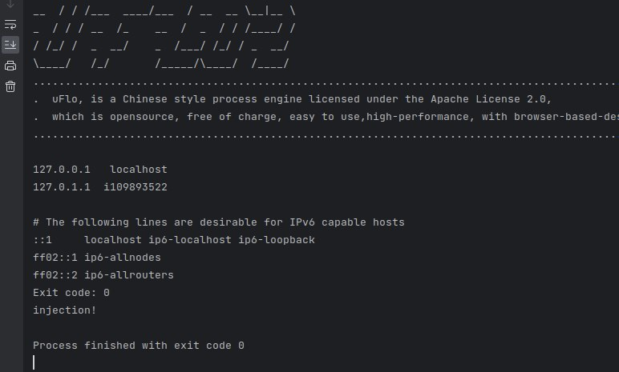

### CVE

https://github.com/advisories/GHSA-8m9f-c5p9-wqch

CVE-2022-25894 [не исправлено] Remote Code Execution (RCE) in the ExpressionContextImpl class via jexl.createExpression(expression).evaluate(context)

### CodeQL
Public методы, куда можно передать строку с подстроками вида ${some code} и этот код будет выполнен:

**class ExpressionContextImpl**

```public synchronized Object eval(ProcessInstance processInstance, String expression)```

```public synchronized Object eval(long processInstanceId, String expression)```

```public synchronized String evalString(ProcessInstance processInstance, String str)```


**class DefaultProcessService**

```public Object getProcessVariable(String key, long processInstanceId)```

```public Object getProcessVariable(String key, ProcessInstance processInstance)```

Sink:
[code link](https://github.com/youseries/uflo/blob/master/uflo-core/src/main/java/com/bstek/uflo/expr/impl/ExpressionContextImpl.java#L126)

### POC

В директории cwe94_poc представлен пример программы, которая выполняет произвольный java код, передавая его в аргумент публичного метода библиотеки.

Для работоспособности данного poc необходимо предоставлять обьект ProcessMapContext через метод getContext у CacheService. Внутри ProcessMapContext мы регистрируем переменную для JexlEngine, через которую будем получать доступ к нашему кастомному классу и выполнять код инъекции. Предоставление контекста с зарегистрированной переменной необходимо ввиду того, что JexlEngine не выполняет произвольный java код (например System.out.println("Hi!") не будет выполнен), а только вручную определенное множество комманд.

 Пример вывода:



### Fix
Нужно убрать возможность через паблик методы выставлять context для JexlEngine (как раз то, что я сделал в секции POC), так как таким образом можно заставить JexlEngine выполнять произвольный код.

